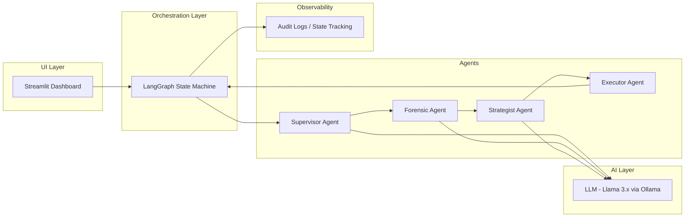

# 🛡️ Autonomous Security & Self-Healing AI Mesh

## 🚀 Overview

This project demonstrates an **Agentic AI Architecture for Autonomous Security Operations (SecOps)**. It simulates a next-generation **self-healing system** that can:

* Detect threats
* Analyze attack patterns
* Generate mitigation strategies
* Execute remediation actions
* Validate outcomes
* Retry intelligently (self-healing loop)

Unlike traditional rule-based systems, this solution uses a **multi-agent, stateful workflow** powered by **LangGraph**.

---

## 🎯 Problem Statement

Modern Security Operations Centers (SOC) face:

* Alert fatigue (high noise, low signal)
* Manual triage overhead
* Slow incident response
* Lack of automated remediation

---

## 💡 Solution

An **Autonomous AI First Responder System** that:

1. Filters noise using a Supervisor Agent
2. Performs deep forensic analysis
3. Generates mitigation strategies
4. Executes remediation steps
5. Verifies outcomes
6. Retries with alternate strategies if needed

---

## 🔄 Architecture Diagram


 

---

## 🧠 Architecture Overview



---

## 🏗️ Key Features

### ✅ Autonomous Triage

* Filters noise before expensive LLM calls
* Reduces compute cost

### ✅ Stateful Reasoning

* Maintains context across steps
* Tracks previous failures and decisions

### ✅ Self-Healing Loop

* Implements cyclic execution using LangGraph
* Automatically retries failed remediation

### ✅ Local AI Deployment

* Runs on **Ollama** with local LLM
* Ensures **data privacy & compliance**

### ✅ Human-in-the-Loop (HITL)

* Streamlit dashboard for visibility
* Supports escalation workflows

---

## 🧰 Tech Stack

| Layer         | Technology    | Purpose                       |
| ------------- | ------------- | ----------------------------- |
| Orchestration | LangGraph     | Stateful multi-agent workflow |
| LLM           | Llama (local) | Reasoning engine              |
| Inference     | Ollama        | Local model serving           |
| UI            | Streamlit     | Monitoring + input            |
| Backend       | Python        | Core logic                    |

---

## 📂 Project Structure

```
src/
 ├── agents/
 │   ├── supervisor.py
 │   ├── forensic.py
 │   ├── strategist.py
 │   └── executor.py
 ├── graph/
 │   └── workflow.py
 ├── utils/
 └── main.py
```

---

## ⚙️ How It Works

1. User submits a log/event
2. Supervisor determines if it's a threat
3. Forensic agent analyzes attack details
4. Strategist generates mitigation plan
5. Executor applies simulated fix
6. System validates outcome
7. If failed → loops back to strategist

---

## 📈 What Makes This Advanced

* Not a chatbot → **State Machine AI System**
* Not linear → **Cyclic execution (self-healing)**
* Not reactive → **Autonomous + decision-making**

---

## 🧪 Example Use Case

**Input:** Suspicious login from unknown IP

**Output:**

* Threat Type: Credential Attack
* Severity: High
* Action: Block IP + Reset credentials
* Status: Resolved / Retry / Escalated

---

## 🚀 Future Enhancements

* Integration with SIEM tools (Splunk, Sentinel)
* Real-time streaming ingestion (Kafka)
* Multi-model routing (cheap vs powerful LLMs)
* Kubernetes deployment

---

## 🧑‍💻 Author

AI Architect | Multi-Agent Systems | Enterprise AI Design

---

## ⭐ Why This Project Matters

This project showcases:

* Enterprise-grade AI architecture
* Real-world problem solving (Security Automation)
* Advanced orchestration using LangGraph
* Production-ready design thinking

---

## 🏁 Conclusion

This is not just an AI project — it's a **blueprint for autonomous enterprise systems** capable of reasoning, acting, and self-correcting in real-time.
